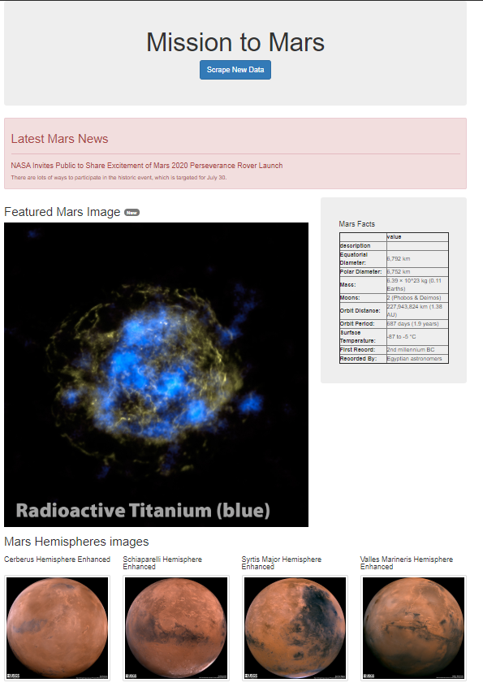

# Mission-to-Mars

## Goals

- Use BeautifulSoup and Splinter to automate a web browser and scrape high-resolution images.
- Use a MongoDB database to store data from the web scrape.
- Update the web application and Flask to display the data from the web scrape.
- Use Bootstrap to style the web app.

## Resources

- Jupyter notebook: cf. **Mission_to_Mars.ipynb**
- App and scraping file: cf. **app.py** & **scraping.py**
- Index template for the app: cf. **index.html** under [templates](templates/) folder

## Note

- a *mars_app* datable need to be created before launching the app
- for hemispheres images, .jpg have been selected as .tiff ones cannot be displayed on Chrome (https://en.wikipedia.org/wiki/Comparison_of_web_browsers#Image_format_support)

## Screenshot of the portofolio

## Personnal portofolio

https://github.com/tom-jj-G/portfolio
